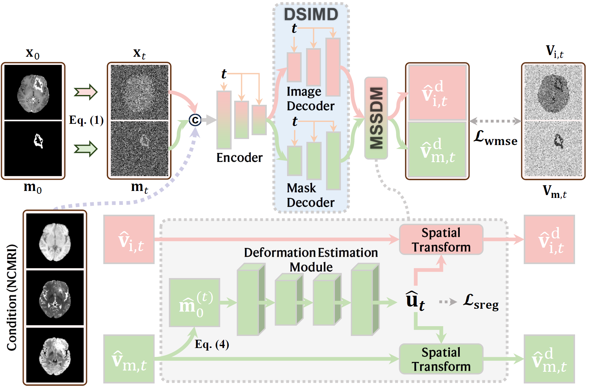

# D3M: Deformation-Driven Diffusion Model for Synthesis of Contrast-Enhanced MRI with Brain Tumors

</img>

Contrast-enhanced magnetic resonance images (CEMRIs) provide valuable information for brain tumor diagnosis and treatment planning.
However, CEMRI acquisition requires contrast agent injection, which poses problems such as health risks, high costs, and environmental concerns.
To address these drawbacks, researchers have synthesized CEMRIs from non-contrast magnetic resonance images (NCMRIs) to remove the need for contrast agents.
However, CEMRI synthesis from NCMRIs is highly ill-posed, where false positive and false negative enhancement can be produced, especially for brain tumors.
In this study, we propose a deformation-driven diffusion model (D3M) for CEMRI synthesis with brain tumors from NCMRIs.
Instead of modeling enhancement errors as intensity errors, we formulate them as incorrect interpretation of tumor subcomponents, where enhanced tumors are misinterpreted as non-enhanced tumors and vice versa.
In this way, the enhancement can be geometrically corrected with spatial deformation.
This reduces the difficulty of CEMRI synthesis, as the intensity error is usually large to correct whereas the geometry correction is relatively small.
Specifically, we first introduce a multi-step spatial deformation module (MSSDM) in D3M.
MSSDM performs image deformation to adjust the enhancement, displacing enhanced regions to remove false positive and false negative enhancement.
Moreover, as the denoising process of diffusion models is stepwise, MSSDM is applied at these multiple diffusion steps.
Second, to further guide the spatial deformation, we incorporate an auxiliary task of segmenting the enhanced tumor, which aids the model understanding of contrast enhancement.
Accordingly, we introduce a dual-stream image-mask decoder (DSIMD) that jointly produces intermediate enhanced images and masks of enhanced tumors.
Results on two public datasets demonstrate that D3M outperforms existing methods in CEMRI synthesis.

# 🚧 Repository Update in Progress 🚧  

## Dataset

BraSyn: https://www.synapse.org/Synapse:syn53708249/wiki/627507

BraTS-PEDs: https://www.synapse.org/Synapse:syn53708249/wiki/627505

## Data Preprocessing

```shell
python preprocess.py
```

## Training

```shell
python train.py
```

## Inference

```shell
python test.py
```